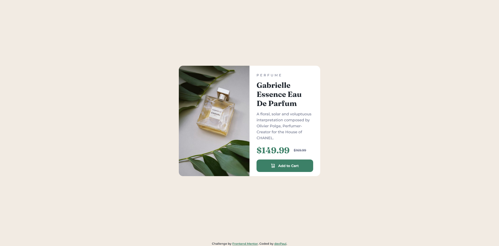

# Frontend Mentor - Product preview card component solution

This is a solution to the [Product preview card component challenge on Frontend Mentor](https://www.frontendmentor.io/challenges/product-preview-card-component-GO7UmttRfa). Frontend Mentor challenges help you improve your coding skills by building realistic projects. 

## Overview

### The challenge

Users should be able to:

- View the optimal layout depending on their device's screen size
- See hover and focus states for interactive elements

### Screenshot

### Links

- Solution URL: [soon](https://your-solution-url.com)
- Live Site URL: [https://dev-paull.github.io/product-preview-card-component/](https://dev-paull.github.io/product-preview-card-component/)

## My process

I didn't have access to any Figma files, so I quickly analyzed the screenshots to determine how to structure the elements. I then imported the provided color palette and fonts, started by building the mobile version, then adapted the component for the desktop-sized version.

### Built with

- Semantic HTML5 markup
- CSS custom properties
- Flexbox
- Mobile-first workflow

### What I learned

I learned more about `<picture>`
